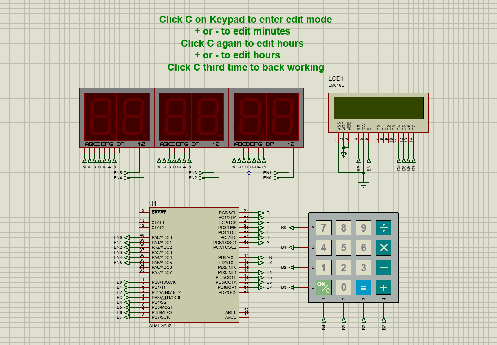

<h1 align="center"> Digital clock </h1>

 Embedded systems project simulates digital clock   

<h2> Requirements </h2>

- Atmega32 microcontroller

- 6 seven segments

- LCD

- Keypad

<h2> System design </h2>

 
